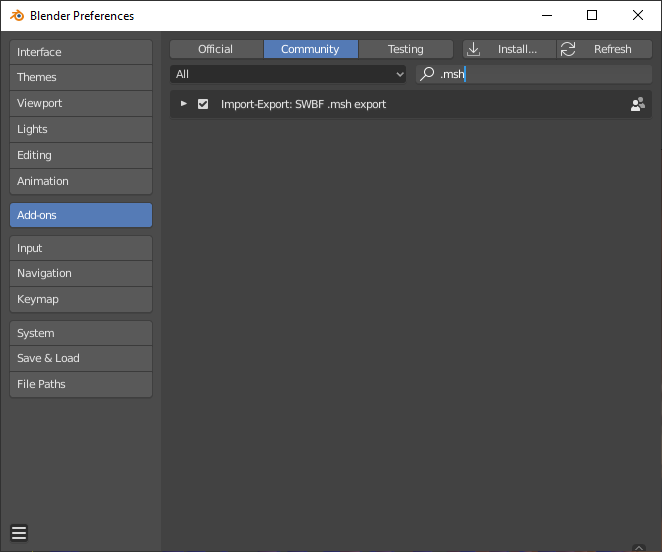

# SWBF-msh-Blender-Export
WIP .msh (SWBF toolchain version) exporter for Blender 2.8

Currently capable of exporting the active scene without skinning information. 

### Installing
You install it like any other Blender addon, if you already know how to do that then great! Grab the [latest release](https://github.com/SleepKiller/SWBF-msh-Blender-Export/releases/latest) (or if you're the adventerous type [clone from source](https://github.com/SleepKiller/SWBF-msh-Blender-Export/archive/master.zip)) and you'll be good to go.

However if you don't know how to install then read on!

These instructions are going to be for Windows. If you're on a different platform I'm sure some quick web searching can help provide you with answers.

First download and extract the addon [latest release](https://github.com/SleepKiller/SWBF-msh-Blender-Export/releases/latest). 

Then open up Explorer and paste `%USERPROFILE%\AppData\Roaming\Blender Foundation\Blender\2.80\` into it's address bar. Then go into the `scripts` folder in that directory and copy the `addons` folder from the extracted addon into the scripts folder.

Next open up Blender, go into Edit > Preferences > Addons. Select "Community" tab and then search for ".msh". "Import-Export: SWBF .msh export" should come up, check the box next to it. The preferences window should look like this once you're done.

If you've done that then the addon is installed and you should now find "SWBF msh" listed under Blender's export options.

### Reference Manual
Included in the repository is a [Reference Manual](https://github.com/SleepKiller/SWBF-msh-Blender-Export/blob/master/docs/reference_manual.md#reference-manual) of sorts. There is no need to read through it before using the addon but anytime you have a question about how something works or why an export failed it should hopefully have the answers.

### Work to be done
- [ ] Investigate and add support for exporting bones and vertex weights.
- [ ] Investigate and add support for exporting animations.
- [ ] Investigate and add support for editing and exporting SWBF2 cloth.
- [ ] Implement .msh importing. Currently you can use the 1.2 release of [swbf-unmunge](releases/tag/v1.2.0) to save out munged models to glTF 2.0 files if you need to open a model in Blender.

### What from [glTF-Blender-IO](https://github.com/KhronosGroup/glTF-Blender-IO) was used?
The `reload_package` function from \_\_init\_\_.py. Before writing this I had barely touched Python and when I saw that glTF-Blender-IO had a function to assist script reloading "I thought that's useful, I think I kinda need that and I don't know how to write something like that myself yet.". And it was very useful, so thank you to all the glTF-Blender-IO developers and contributors.
