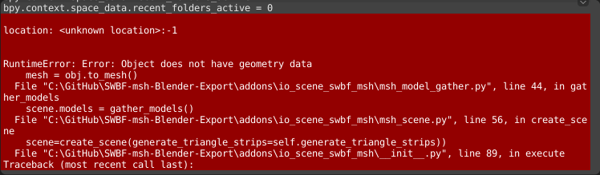
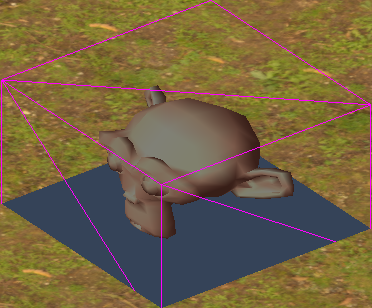
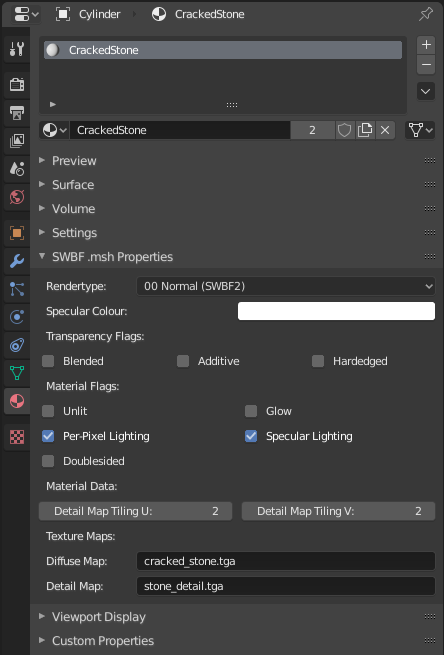
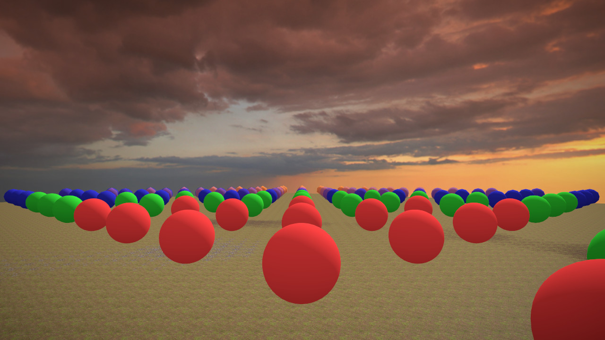

# Reference Manual

## Index
- [Exporter](#exporter)
  + [Export Properties](#export-properties)
  + [Export Failures](#export-failures)
  + [Export Behaviour to Know About](#export-behaviour-to-know-about)
- [Importer](#importer)
  + [Import Properties](#import-properties)
  + [Import Failures](#import-failures)
  + [Import Behaviour to Know About](#import-behaviour-to-know-about)
- [Shadow Volumes](#shadow-volumes)
- [Terrain Cutters](#terrain-cutters)
- [Collision](#collision)
  + [Collision Primitives](#collision-primitives)
  + [Collision Meshes](#collision-meshes)
  + [Collision Flags](#collision-flags)
  + [Vehicles and Collision](#vehicles-and-collision)
- [Hardpoints](#hardpoints)
- [LOD Models](#lod-models)
- [Materials](#materials)
  + [Materials.Rendertype](#materialsrendertype)
  + [Materials.Transparency Flags](#materialstransparency-flags)
  + [Materials.Flags](#materialsflags)
  + [Materials.Data](#materialsdata)
  + [Materials.Texture Maps](#materialstexture-maps)
  + [Materials Operators](#materials-operators)
- [Skeletons and Skinning](#skeletons-and-skinning)
  + [XSI vs Blender](#xsi-vs-blender)
  + [Example Skin Hierarchy](#example-skin-hierarchy)
  + [Example Bone-Parent Hierarchy](#example-bone-parent-hierarchy)
  + [Skeleton Notes](#skeleton-notes)
  + [Skinning Notes](#skinning-notes)
- [Animation](#animation)
  + [Actions and Animations](#actions-and-animations)
  + [Animation Notes](#animation-notes) 
- [Appendices](#appendices)
  + [Appendix Detail Map Blending](#appendix-detail-map-blending)
  + [Appendix Normal Map Example](#appendix-normal-map-example)
  + [Appendix Cubemap Layout](#appendix-cubemap-layout)
  + [Appendix .msh.option Files](#appendix-mshoption-files)
  + [Appendix .tga.option Files](#appendix-tgaoption-files)
  + [Appendix Rendertypes Table](#appendix-rendertypes-table)
  + [Appendix LOD Models Visualizations](#appendix-lod-models-visualizations)

## Exporter
The currently exporter has pretty straight forward behaviour. It'll grab the current active scene and export it as a .msh file that can be consumed by Zero Editor, modelmunge, and zenasset.


### Export Properties

#### Generate Triangle Strips
Enables or disables Triangle Strips generation.

Triangle strip generation can be slow for meshes with thousands of faces and is off by default to enable a fast mesh iteration workflow if desired.

In order to improve runtime performance and reduce munged model size you are **strongly** advised to turn **Enable** triangle strip generation for your "final" export.

For very complex scenes with meshes that have tens of thousands (or more) faces Blender may freeze up for a couple minutes while triangle strips are generated. Either minimize it and do something else on your PC while you wait and it'll eventually finish.

#### Export Target
Controls what to export from Blender.

|                        |                                                                        |
| ---------------------- | ---------------------------------------------------------------------- |
| Scene                  | Export the current active scene.                                       |
| Selected               | Export the currently selected objects and their parents.               |
| Selected with Children | Export the currently selected objects with their children and parents. |


#### Apply Modifiers
Whether to apply [Modifiers](https://docs.blender.org/manual/en/latest/modeling/modifiers/index.html) during export or not.

#### Export Animation(s)

|                        |                                                                        |
| ---------------------- | ---------------------------------------------------------------------- |
| None                  | Export the current active scene without animation data.                                       |
| Active               | Export the current active scene with animation data extracted from the active Action on the scene's Armature.  To save space, the exporter will exclude geometry data from the resulting .msh file but will ensure the root object has some geometry and a material for munge compatibility.               |
| Batch | Export the current active scene with animation data but produce a separate .msh file for and named after each Action in the scene.  Exported files will be placed in the selected directory.  If a file is selected, they will be placed in that file's directory.  This option essentially repeats the export behavior of "Active" for each Action in the current Scene.  Be sure to remove an Action from the scene if you do not want it exported!   |


### Export Failures
There should be few things that can cause an export to fail. Should you encounter one you can consult the list below for how to remedy the situation. If you're error isn't on the list then feel free to [Open an issue](https://github.com/SleepKiller/SWBF-msh-Blender-Export/issues/new), remember to attach a .blend file that reproduces the issue.

As of Blender 2.8 after an export has failed you can look in the "Scripting" workspace and in the bottom left corner you should be able to look for and find the description of the "RuntimeError" that caused the failure.



The "RuntimeError" at the top of the callstack should contain the error message. The [System Console](https://docs.blender.org/manual/en/latest/advanced/command_line/launch/windows.html?highlight=toggle%20system%20console#details) should also contain the error and can be easier to read.

#### "RuntimeError: Error: Object does not have geometry data"
This is currently known to only happen for [Grease Pencil](https://docs.blender.org/manual/en/latest/grease_pencil/index.html) objects. There is currently no support in Blender for easilly converting a Grease Pencil object into a temporary mesh in Python the same way you do for other objects, hence no direct support for exporting them.

To solve this error you can manually convert the Grease Pencil object to a mesh before exporting.

#### "RuntimeError: Object '\{object name\}' has resulted in a .msh geometry segment that has more than 32767 vertices! Split the object's mesh up and try again!"
This error indicates that after turning a Blender mesh into geometry segments for a .msh file that one of the geometry segments
had more vertices than is supported in a .msh file. 

.msh geometry segments are created by iterating through a mesh's faces and assigning them to a segment based on their material. A mesh produces as many geometry segments as materials it uses. So a mesh that uses 3 materials will produce 3 geometry segments.

To solve this error you must cut the offending Object's mesh up so that no single geometry segment made from it has more than 32767 vertices.

#### "RuntimeError: Object '\{object name\}' is being used as a sphere collision primitive but it's dimensions are not uniform!"
This error indicates that an object marked as a sphere Collision Primitive X length, Y length and Z length are not equal.

Rather than export a collision primitive that doesn't match what you see in Blender the exporter instead raises the error to let you know and provide you the chance to fix it.

Fixing it should be as simple as making sure the sure representing your Collision Primitive is indeed a sphere and not an ellipsoid. Make sure it's [Scale Transform](https://docs.blender.org/manual/en/latest/scene_layout/object/editing/transform/basics.html#scale) is uniform and that you have not made any changes to the vertices or faces that would cause the mesh to cease being a sphere. (Or an approximation of one.)

If all else fails, simply add a new UV sphere or Ico Sphere with the intended radius and location of the problematic Collision Primitive. Then delete the old one and try exporting again.

#### "RuntimeError: Object '\{object name\}' is being used as a cylinder collision primitive but it's X and Y dimensions are not uniform!"
This error indicates that an object marked as a cylinder Collision Primitive X length and Y length are not equal. Cylinder Collision Primitives in .msh files require a uniform radius.

Rather than export a collision primitive that doesn't match what you see in Blender the exporter instead raises the error to let you know and provide you the chance to fix it.

In order to fix this first ensure the problematic object's [Scale Transform](https://docs.blender.org/manual/en/latest/scene_layout/object/editing/transform/basics.html#scale)'s X and Y axes have the same value. Then make sure there are no faces/vertices that are outside the intended radius of the cylinder and try again.

If all else fails, simply add a new Cylinder with the intended radius, length, location and rotation of the problematic Collision Primitive. Then delete the old one and try exporting again.

#### "RuntimeError: Object '\{object name\}' has no primitive type specified in it's name!"
This error indicates that an object in your scene has "p_" in it's name, indicating it is a Collision Primitive but does not also contain a Collision Primitive type in it's name.

To solve this error consult the [Collision Primitives](#collision-primitives) section and rename the problematic Collision Primitive accordingly. Usually by adding "sphere, "cylinder" or "box" to the name.

#### "RuntimeError: Object '{object name}' has unknown LOD suffix at the end of it's name!"
This error indicates that an object in your scene ends with what looks like an LOD suffix but that the suffix will not be recognized by modelmunge. This error is purely intended to help catch typos.

To solve this error consult the [LOD Models](#lod-models) section and rename the problematic objects to use the correct LOD suffix.

#### "RuntimeError: Could not find an Armature object from which to export animations!"
This error is thrown when you intend to export one or more animations but no Armature is found among the objects to be exported.


### Export Behaviour to Know About

#### Materials for .msh files must be managed through the added UI panel named "SWBF .msh Properties" is added under the Material context.
Unsurprisingly Blender's modern and sophisticated materials don't map down well/easilly to what .msh files support. Thus seperate properties are provided for all .msh material properties.

See the Materials section in this document for more info.

#### Meshes and Transforms are converted from Blender's coordinate space to .msh file coordinate space during export.
This involves swapping the Y and Z axes and mirroring the X axis. In most cases this should just create the result you expect as the resulting .msh file should be aligned the same way in Blender, ingame (after going through modelmunge) and in Zero Editor.

#### For UV layers and vertex colors layers it is the active layer that is exported.
Unlikely to come up since if you're working on a model for SWBF you're unlikely to have multiple layers to start with but incase you do, there you go.

#### If a scene has multiple "roots" they will be reparented to a new "root" added during export.
This is to make sure the .msh file only has one root in it. Any object that doesn't have a parent is considered a root.

There is no need to explicitly make sure your scene only has one root as a result of this, it is fine to let the exporter add one and perform the reparenting.

#### Object scales are applied during export in world space.
Despite `.msh` files have a field in their transform section for scale it seams to get ignored by modelmunge.

As a result there is no point in even trying to export the scale. Instead it is applied to a the vertex coordinates during export.

The world space scale is fetched for an object and applied to all the vertex coordinates.

#### Object types with no possible representation in .msh files are not exported unless they have children.
Currently the exporter considers the following object types fall in this category. As I am unfamilar with Blender it is possible that more object types should be added.

- Lattices
- Cameras
- Lights
- Light Probes
- Speakers

If an object with one of the above types has children it is always exported as an empty.

#### Objects whose name starts with "sv_", "p_" or "collision" will be marked as hidden in the .msh file.
This should be consistent with other .msh exporters.

#### Objects whose name ends with "_lod2", "_lod3", "_lowres" or "_lowrez" will be marked as hidden in the .msh file.
This should be consistent with other .msh exporters.

#### For completeness poloygons (`NDXL` chunks), triangles (`NDXT`) and triangle strips (`STRP`) are all saved. 
This should hopefully give the .msh files the greatest chance of being opened by the various tools out there.

Saving polygons also will make any hypothetical importer work better, since quads and ngons could be restored on import.

The triangle strips are generated using a brute-force method that seams to give decent results.

#### If a scene has no materials a default one will be added to the resulting .msh file.
Can't imagine this coming up much (Maybe if you're model is just for collisions or shadows?) but that's how it works.

#### Meshes without any materials will be assigned the first material in the .msh file.
This shouldn't be relevant as any mesh that you haven't assigned a material to is likely to just be collision geometry or shadow geometry.

#### Dummy frames for the scene root will be included when exporting an animation.
If the scene root is not keyed in the Action(s) to be exported, dummy frames for the scene root with no translation or rotation will be added to the exported animation.

## Importer

This plugin can import one or more .msh files as well as .zaabin files.  .msh files can be imported as models or animations.

### Import Properties

#### Import Animation(s)

If you wish to import animation data from one or more .msh files or a single .zaabin file, check this box.  This will only work so long as you have preselected an Armature!  The imported animations will then be added to the Armature as Actions. If an Action with the same name already exists, the importer will replace it.

### Import Failures


#### "RuntimeError: Select an armature to attach the imported animation to!"

Be sure to have an armature selected before you import an animation.

#### "RuntimeError: No animation found in msh file!"

You tried to import an animation from a file with no animation data.

#### "struct.error: unpack requires a buffer of x bytes"

Serious bug with many possible causes, please notify a dev.


### Import Behaviour to Know About

#### Deleted skeleton meshes 

If the .msh model to be imported has nodes with meshes that are weighted to or animated, the mesh data on that node will be lost upon import. This is because nodes that are weighted to or animated must be converted to bones in an armature, and bones in an armature cannot be meshes.  Eventually we will add functionality to preserve the mesh as a specially named child object of the relevant armature bone.

#### Normals and vertex colors

Normals and vertex colors are currently not imported.  Normals will be calculated by Blender.


## Shadow Volumes
SWBF's rendering engine uses Shadow Volumes for it's shadows. What this means is that the mesh for the shadow is seperate and different from the main mesh. And in order for your model to have shadows you must make the shadow mesh. 

modelmunge will handle the actual Shadow Volume generation for you. You just have to make sure you follow a couple rules.

The first is that any shadow mesh in your scene should begin with "sv_", this will mark it as a Shadow Volume.

Next your the mesh for your Shadow Volume should form a completely enclosed mesh. It should have no gaps that let you see inside it.

Finally because of the way Shadow Volumes work for performance concerns it can be advisable to not have your shadow mesh be full detail and instead have it be a reasonable (and believeable of course) low-resolution approxomation of your real mesh.

That's all there is to it. Basically just make sure your shadow meshes' object names start with "sv_", they're enclosed and not wasteful with their polygons. The exporter and then modelmunge will take care of everything from there.

## Terrain Cutters
In .msh files any object starting with "terraincutter" results in it "cutting" terrain when it is used as a prop in Zero Editor. Below the results of this can be seen for a cube named "terraincutter_Cube".



## Collision
For anything that isn't a player model (they get their own collision from the game) or a weapon you'll probably want it to have collision so the player can actually interact with it.

Pandemic's orginal documentation for collision reccomends Collision Primitives wherever possible
and Collision Meshes where you need accuracy.

All collision objects are created by giving an object a special name. Either "collision_\[-flags-\]meshname" for meshes or "p_\[-flags-\]primitivename" for primitives. The Collision Flags are optional. 

| Name Examples      |
|:------------------ |
| p_-tb-cylinder     |
| p_cube             |
| collision_-os-mesh |
| collision_mesh     |

There is a limit of 64 collision objects per model file. Collision meshes are merged by modelmunge and as a result they only ever take up one slot.

> NOTE: The limit for collision primitives in SWBF1 is 32.

### Collision Primitives
Collision primitives are the game's (according to the docs) lightweight method of adding collision to an 
object and are preferred to collision meshes whenever reasonable.

Unfortunately Blender does not seam to have a way to just have a Sphere, Cylinder or Box based on it's dimensions. It has to be a mesh. This a problem because the game defines collision primitives based on their type and dimensions.

In order to provide support for exporting them the addon requires you to follow some conventions. 

First all collision primitive objects must start with "P_", this let's the addon know the object is a collision primitive.

Next the object must contain one of the below strings in "Possible Name" column to let the addon know the shape it should use for the primitive. So "p_hitbox" would define a box primitive, whereas "p_icosphere_crithit" would define a sphere primitive.

| Type     | Possible Name               |
|:--------:|:---------------------------:|
| sphere   | "sphere", "sphr" or "spr"   |
| cylinder | "cylinder", "cyln" or "cyl" |
| box      | "box", "cube" or "cuboid"   |

Finally the addon will grab the dimensions of the object and use those as the size of primitive. If the dimenions do not make sense for a primitive type (for instance if the dimensions of a sphere indicate would define it as an ellipsoid) then an error will be raised on export in order to prevent you exporting collision that does not match your visual representation of it.  

### Collision Meshes
Collision meshes are for when Collision Primitives are not able to represent the collision accurately. They should be a low-resolution version of the original mesh. In order to provide accurate collisions they should completely enclose the original mesh. (That is no face in the collision mesh should dip below a face in the original mesh.)

A useful tool for quickly making collision meshes is the [Convex Hull](https://docs.blender.org/manual/en/latest/modeling/meshes/editing/vertices.html#convex-hull) vertex tool. For plenty of meshes the convex hull of the mesh will provide believable collisions ingame, be fast to make (you just need to make a copy of the mesh and then Blender can do it for you), perform well and use little memory.

Collision meshes are combined by modelmunge. So if two collision meshes have conflicting flags (like "collision_-os-mesh0" and "collision_-v-mesh1") it is unspecified which flags will be used. If one of the meshes does not have flags like (like "collision_-os-mesh0" and "collision_mesh1") then it's flags will become that of the other mesh.

Furthermore because collision meshes are combined by modelmunge they can not be animated/moved at runtime (they'll move, just all as one part and relative to the objects root only). If you need moving parts (for say a turret on a vehicle) to have collision you must use Collision Primitives.

### Collision Flags

| Flag | Meaning                             |
|:----:|:----------------------------------- |
| s    | Collides with soldiers.             |
| v    | Collides with vehicles.             |
| b    | Collides with buildings/props.      |
| t    | Collides with terrain.              |
| o    | Collides with ordnance/projectiles. |

> NOTE: SWBF1 does not support the collision flags naming scheme and must instead explicitly call out primitves as being only for soldiers/projectiles/etc in the .odf.


### Vehicles and Collision
Vehicles have a couple special cases with collision. Below there are going to be some references to .odf files since they are where the special cases come from. Explaining .odf files and there place in SWBF's toolchain is outside the scope of this documentation.

The first is that the collision the AI aim at can be customized by setting "TargetableCollision" in the vehicles .odf to the name of a Collision Primitive. Nothing will actually collide with the set primitive. However units inside the "targetable" Collision Primitive will be able to enter the vehicle as though they were touching it.

The second is that if the vehicle has "Body Springs" (through "AddSpringBody" in .odfs) then the collision flags of both Collision Primitives and Collision Meshes will be ignored. Furthermore they actually won't be used at all unless explictly called out in the .odf. The following properties must be used to manually reference all of the vehicles collision primitives. 

| Property            | Equivalent Flag                     |
|:------------------- |:-----------------------------------:|
| SoldierCollision    | s                                   |
| VehicleCollision    | v                                   |
| BuildingCollision   | b                                   |
| TerrainCollision    | t                                   |
| OrdnanceCollision   | o                                   | 
| TargetableCollision |                                     |

Using them in your .odf is as simple as using any other .odf property. 
```
SoldierCollision = "p_-s-cube"
```

To reference a Collision Mesh using these properties you must do the following. Using the name of the Collision Mesh from Blender/.msh file will not work.
```
SoldierCollision = "CollisionMesh"
```

> NOTE: The above is also how collision primitives must be setup in SWBF1.

Finally vehicles can also set a Collision Primitve to be their "critical hit" spot using "HitLocation" in the .odf.
```
HitLocation = "p_icosphere_crithit 3.0" // The trailing number is the damage multiplier for the critical hit.
```

## Hardpoints
Any [Empty](https://docs.blender.org/manual/en/latest/modeling/empties.html) object that begins with "hp_" is treated as a hardpoint by modelmunge. Hardpoints are used as reference points for a variety of things, like attaching a particle effect to a model or setting the seat location of a vehicle to name a couple.

Other empties/objects can be hardpoints but modelmunge must be explicitly told to keep them, see "-keep"/"-keepall" in [Appendix .msh.option Files](#appendix-mshoption-files).

## LOD Models
Models can have Level of Detail copies of themselves that will be used by the game instead of the full detail mesh when the model is far away from the camera or is almost out of view of the camera. When properly utilitized LOD systems can cut down on the GPU cost of a scene without compromising the end result.

A Blender object can be marked as being part of an LOD model by using one of the follow suffixes. The table is listed in order of the intended detail level of each LOD model.

| Suffix    | .model LOD Result                                   |
|:--------- |:---------------------------------------------------:|
| No Suffix | LOD0 (Full Detail)                                  |
| _lod2     | LOD1                                                |
| _lod3     | LOD2                                                |
| _lowres   | LOWD (Low detail mesh for the Far Scene.)           |
| _lowrez   | Alias for _lowres                                   |

Objects with the same suffix (say "door_lod2" and "frame_lod2") will become part of the same LOD model.

See [Appendix LOD Models Visualizations](#appendix-lod-models-visualizations) to get a quick idea of how the game selects LOD models by default.

## Materials
Since Blender's sophisticated materials are a poor fit for what .msh files can represent the addon defines
custom properties for representing .msh materials. It then exposes these through a UI panel under Blender's
Material context.



> TODO: Explain why some .msh rendertypes were left out of the addon. (The short answer is they're either redundant or outright unused.)

> TODO: Document what rendertypes/flags are multipass and cause the model to be drawn more than once. And explain the implications of that.

### Materials.Rendertype
Rendertypes in .msh materials confer unique information about how the material. Such as
if the materials textures scroll or if the material has an environment map.

> One could argue that "rendertype" should be stylized as "render type". I thought about that and decided I'd rather spend time writing the addon than thinking about that.

#### Materials.Rendertype.Normal (SWBF2)
Basic material.

Can optionally have a Detail Map. Tiling for the detail map can specified with Detail Map Tiling U and Detail Map Tiling V.

#### Materials.Rendertype.Scrolling (SWBF2)
Like Normal except the textures have scrolling. Useful for water, monitors with scrolling content, interlaced holograms, etc.

Scroll speed and direction is specified with Scroll Speed U and Scroll Speed V.

Can optionally have a Detail Map. The Detail Map will not be affected by scrolling.

#### Materials.Rendertype.Envmapped (SWBF2)
Uses an Environment Map to show reflections on the model. Useful for anything you want to look reflective or 
metallic.

The reflections from the Environment Map are affected by Specular Colour. And if Specular Material Flag is checked then reflections will be affected by the Gloss Map.

Can optionally have a Detail Map. Tiling for the detail map can specified with Detail Map Tiling U and Detail Map Tiling V.

#### Materials.Rendertype.Animated (SWBF2)
Use an animated texture. The animation's frames should be packed into NxN squares where N is the square root of the number of frames in the animation. So a 25 frame animation should be packed into 5x5 squares in the Diffuse Map.

Set frame count with Animation Length and frame rate with Animation Speed.

Can optionally have a Detail Map. The Detail Map will not be subject to animation.

#### Materials.Rendertype.Refraction (SWBF2)
Distorts/refracts the scene behind the material. 

The Diffuse Map's alpha channel controls the visibility of the scene while the Distortion Map controls the distortion.

When distortion is not needed but transparency is the Normal rendertype should be used as this one comes at a performance cost.

The Material Flags are not exposed by the addon for this rendertype as most are unsupported by it. The Blended Transparency flag is supported and **required** but is set automatically by the addon.

#### Materials.Rendertype.Blink (SWBF2)
Oscillates the diffuse strength of the material between full strength and a supplied strength.

Blink Minimum Brightness sets the strength of the material's diffuse at the bottom of the "blink". Blink Speed sets the speed of the blinking.

Can optionally have a Detail Map.

#### Materials.Rendertype.Normalmapped (SWBF2)
Enables the use of a Normal Map with the material.

Can optionally have a Detail Map. Tiling for the detail map can specified with Detail Map Tiling U and Detail Map Tiling V.

This rendertype also enables per-pixel lighting. 

#### Materials.Rendertype.Normalmapped Tiled (SWBF2)
Enables the use of a Normal Map with the material. Tiling for the normal map can be controlled with Normal Map Tiling U and Normal Map Tiling V.

Can optionally have a Detail Map.

This rendertype also enables per-pixel lighting.

#### Materials.Rendertype.Normalmapped Envmapped (SWBF2)
Enables the use of a Normal Map with the material.

Uses an Environment Map to show reflections on the model. Useful for anything you want to look reflective or 
metallic.

The reflections from the Environment Map are affected by Specular Colour. And if Specular Material Flag is checked then reflections will be affected by the Gloss Map.

Can optionally have a Detail Map. Tiling for the detail map can specified with Detail Map Tiling U and Detail Map Tiling V.

This rendertype also enables per-pixel lighting.

#### Materials.Rendertype.Normalmapped Tiled Envmapped (SWBF2)
Enables the use of a Normal Map with the material. Tiling for the normal map can be controlled with Normal Map Tiling U and Normal Map Tiling V

Uses an Environment Map to show reflections on the model. Useful for anything you want to look reflective or 
metallic.

The reflections from the Environment Map are affected by Specular Colour. And if Specular Material Flag is checked then reflections will be affected by the Gloss Map.

Can optionally have a Detail Map.

This rendertype also enables per-pixel lighting.

#### Other
These tools currently do not support render types not previously listed.  If you select "Other" from the rendertype dropdown menu, you'll be able to set the number value of the exact rendertype you want.  Since the meanings of the specific textures and data values are not supported yet for these render types, they will be listed as texture0-3 and data-value0-3 respectively. 

### Materials.Transparency Flags

> TODO: Improve this section.

#### Materials.Transparency Flags.Blended
Regular alpha blended transparency.

#### Materials.Transparency Flags.Additive
Additive transparency, objects behind the material will appear brighter because the material will be "added" on top of the scene.

#### Materials.Transparency Flags.Hardedged
Hardedged/alpha cutout/clip transparency. Any point on the material with an alpha value below the threshold of 0.5/0x80/128 will be discarded. Useful for leaves, flowers, wire fences and all sorts.

### Materials.Flags

#### Materials.Flags.Unlit
Makes the material unlit/emissive. Useful for anything that is meant to be giving light but not reflecting any/much.

#### Materials.Flags.Glow
Same as 'Unlit' but also enables the use of a Glow Map in the diffuse texture's alpha channel. The material will be significantly significantly brightened based on how opaque the Glow Map is.

Note that despite the name this doesn't automatically create "glowing" materials. What it does do is let you brighten a material enough so that it'll pass the game's bloom threshold (which is set by the map) and then the bloom effect will cause it to "glow".

#### Materials.Flags.Per-Pixel Lighting
Calculate lighting per-pixel instead of per-vertex for diffuse lighting.

#### Materials.Flags.Specular Lighting
Use specular lighting as well as diffuse lighting. A Gloss Map in the diffuse map's and normal map's alpha channel can be used to attenuate the specular lighting's strength. (More transparent = less strong).

The Specular Colour controls the colour of the reflected specular highlights, like the diffuse map but for specular lighting and global across the material.

#### Materials.Flags.Doublesided
Disable backface culling, causing both sides of the surface to be drawn. Usually only the front facing surface is drawn.

### Materials.Data

#### Materials.Data.Detail Map Tiling U
Tiling of the Detail Map in the U direction. A value of 0 is valid and means no tiling.

#### Materials.Data.Detail Map Tiling V
Tiling of the Detail Map in the V direction. A value of 0 is valid and means no tiling.

#### Materials.Data.Normal Map Tiling U
Tiling of the Normal Map in the U direction. A value of 0 is valid and means no tiling.

#### Materials.Data.Normal Map Tiling V
Tiling of the Normal Map in the V direction. A value of 0 is valid and means no tiling.

#### Materials.Data.Scroll Speed U
Texture scroll speed in the U direction.

#### Materials.Data.Scroll Speed V
Texture scroll speed in the V direction.

#### Materials.Data.Animation Length
Number of frames in the texture animation.

Valid Values

|     |     |     |     |     |     |     |     |
|:---:|:---:|:---:|:---:|:---:|:---:|:---:|:---:|
| 1   | 4   | 9   | 16  | 25  | 36  | 49  | 64  |
| 81  | 100 | 121 | 144 | 169 | 196 | 225 |     |

#### Materials.Data.Animation Speed
Animation speed in frames per second.

#### Materials.Data.Blink Minimum Brightness
Sets the strength of the material's diffuse at the bottom of the "blink".

#### Materials.Data.Blink Speed
Speed of blinking, higher is faster.

### Materials.Texture Maps
All textures should be the names or paths to .tga files. SWBF's toolchain does not support .tga files with RLE (Run Length Encoding) compression or paletted .tga files. They should either be 8-bit greyscale, 24-bit RGB or 32-bit RGBA.

#### Materials.Texture Maps.Diffuse Map
The basic diffuse map for the material. The alpha channel is either the Transparency Map, Glow Map or Gloss Map, depending on the selected rendertype and flags.

Textures are not automatically copied over to the .msh file's folder on export at this time.

#### Materials.Texture Maps.Detail Map
Detail maps allow you to add in 'detail' to the Diffuse Map at runtime. 

Or they can be used as fake ambient occlusion maps or even wacky emissive maps.

See Appendix Detail Map Blending for a rundown of the details of how they're blended in
with the Diffuse Map.

#### Materials.Texture Maps.Normal Map
Normal maps can provide added detail from lighting. They work much the same way as in any other game/application that uses Tangent Space Normal Maps. See Appendix Normal Map Example if you require a rundown of Normal Maps.

If Specular is enabled the alpha channel will be the Gloss Map.

#### Materials.Texture Maps.Environment Map
Environment map for the material. Used to provide static reflections for the model. Must be a cubemap, see Appendix Cubemap Layout.

#### Materials.Texture Maps.Distortion Map
Distortion maps control how Refractive materials distort the scene behind them. Should be a Normal Map with '-forceformat v8u8' in it's '.tga.option' file. See Appendix .tga.option Files.


### Materials Operators

#### Fill SWBF Properties
Fills in SWBF properties of each material used by a currently selected object.  This operator will only work with materials that have ```Use Nodes``` enabled and will just fill in the Diffuse Map property with the name of the image used by the material's Principled BSDF node.  

It is used by selecting the relevant objects and choosing `SWBF` > `Fill SWBF Material Properties` in the `Object Context` menu:


## Skeletons and Skinning

This guide assumes you have working knowledge of Blender Armatures and deformation with vertex groups, as well as how to create, edit, pose, and keyframe bones in an Armature.

### XSI vs Blender

XSI has a very free-form take on skeletons and skinning.  Models can be skinned to other models in a rather arbitrary manner, whereas in Blender, a model can only be skinned if it is parented to an armature and can only skin to bones in that armature.  

Moreover, Zero Editor requires that skinned models be parents of their skeletons, which directly contradicts the structure Blender mandates! The exporter works around this by reparenting skinned objects to their armature's parent, and reparenting the root bones of the armature to the skin object. Note in the examples below that the armature's bones are not technically part of the scene's object hierarchy in Blender, as they belong to the armature object itself.

### Example Skin Hierarchy
Upon export, skinned objects are reparented to the armature's parent, and the armature skeleton reparented to the main skinned object:

#### Blender 
* dummyroot       
  * Armature     
    * bone_root          
      * bone_one       
      * bone_two  
    * skinned_obj
    * sv_skinned_obj
    * skinned_obj_lowrez  
    
#### Exported
* dummyroot
  * skinned_obj
    * bone_root
      * bone_one
      * bone_two
  * sv_skinned_obj
  * skinned_obj_lowrez
  
### Example Bone Parent Hierarchy
The same goes for objects that are children of an armature, but are parented directly to bones in that armature, as could be the case in a simple door:

#### Blender
* dummyroot
  * Armature
    * bone_doorleft
    * bone_doorright
    * left_door_mesh  (bone parent: bone_doorleft)
    * right_door_mesh (bone parent: bone_doorright)

#### Exported
* dummyroot
  * bone_doorleft
    * left_door_mesh
  * bone_doorright
    * right_door_mesh
  
### Skeleton Notes
1. Animated msh bones can have have geometry. To accomplish this, create a bone in the scene's armature and a mesh object with the same name as the bone.  Parent the mesh object to the bone and make sure their origins are equal.  When exported, the bone and the mesh object will be merged into one.  The inverse process occurs when importing bones with geometry. 

### Skinning Notes

Skinning/vertex-weighting in Blender is a very complex topic, these docs will focus solely on your considerations for exporting a SWBF compatible skin.  

1. .msh files can weight a vertex to a maximum of 4 bones.  When painting weights, ensure each vertex is meaningfully influenced by a maximum of 4 bones. It won't break the exporter if you exceed 4, but the 4 largest weights per-vertex will be kept and renormalized, and the others will be discarded. It is also worth mentioning however that SWBF2 (PC) only appears to supports 1 weight per vertex, despite the toolchain accepting and processing .msh files with more weights.

2. An object will be exported as a skin if it is parented to an armature and has vertex groups.  The skeleton will be reparented to the skin object which is not named as a collision or LOD object.  

3. As is the case with exporting in XSI, make sure you apply transforms on your skinned objects before exporting! 


## Animation

This guide assumes you know how Armatures work, and how to switch between, create, and edit Actions in Blender.

### Actions and Animations

This exporter can convert Actions used by Armatures to animations compatible with SWBF's toolchain. If an armature is found among the objects to be exported, the exporter can include the armature's currently set Action as an animation in the .msh file.  As of now, animation via Armature is the only way to export Blender Actions.

When exporting an Action, all frames between and including the first and last *keyframes* of the Action will be included.  For example, if the first and last keyframes are 0 and 5, the exporter will record bone positions at frames 0, 1, 2, 3, 4, and 5, regardless of how many frames are actually keyed.  Don't worry about using as few keyframes as possible to save a smaller animation as the exporter will record bone positions and rotations for each frame.

If you have armature bones that are weighted to by a skinned object, but you do not wish for them to be exported as part of the animated skeleton, don't keyframe them.  The exported animation will only include bones that are explicitly keyframed at least once in the Action.


### Animation notes:  

1. If exporting an animation, your exported .msh file's name should be that of the animation/action itself.

2. Bone constraints are not exported.

3. Don't include multiple armatures in one export!

4. Blender's animation speed defaults to 24 fps.  If you want to see exactly how your animation will play ingame, set it to 29.97 in the `Output Properties` section of the `Properties` editor.


## Appendices

### Appendix Detail Map Blending

> TODO: Write this section (with pretty pictures).

### Appendix Normal Map Example

> TODO: Write this section (with pretty pictures).

### Appendix Cubemap Layout

> TODO: Write this section (with layout reference).

### Appendix .msh.option Files
.msh files aren't actually the model format used by the game engine. In order to get them into the game engine's format they're ran through modelmunge which exports it into the game engine's format. 

Some of modelmunge's behaviour when exporting a .model file can be customized by creating a .msh.option file in the same folder as the .msh file. If you had "fountain.msh", it's .msh.option file would be named "fountain.msh.option".

.msh.option files are just plaintext ASCII files containing arguments for modelmunge for that .msh file. The contents of an example one is below.

```
-vertexlighting
-keep water_emitter0 water_emitter1 water_emitter2
```

Below is a list of the most relevant .msh.option arguments. There are more than this but they either don't work (-noprojectionlights), are dangerous to use and can cause crashing ingame (-maxbones) or unclear why you'd ever want to use them (-donotmergeskins).

#### -keep
- Usage Example: `-keep aimer_turret turret_barrel`

Takes a list of object names in the .msh file and keeps those objects as hardpoints.

#### -keepall
- Usage Example: `-keepall`

Keep all named objects in the .msh file as hardpoints.

#### -keepmaterial
- Usage Example: `-keepmaterial override_texture`

Prevents the named object being marged with other objects by modelmunge and gives the object's .model material the same name as the object. 

This is used with the "OverrideTexture", "OverrideTexture2" and "WheelTexture" .odf properties.

#### -scale
- Usage Example: `-scale 2.0`

Takes a scale and applies it uniformly to the .msh file as it is exported. Minimally useful.

#### -vertexlighting
- Usage Example: `-vertexlighting`

Marks the .msh file as being vertex lit. 

Any vertex colours in the .msh file will be used as static diffuse lighting and any lights in the game marked as "Static" will not affect any mesh in the .msh file that has vertex colours.

#### -nocollision
- Usage Example: `-nocollision`

If the .msh file has no Collision then prevents automatic creation of a Collision Mesh. 

Else prevents usage of any Collision Mesh in the .msh. Has no affect on Collision Primitives.

### Appendix .tga.option Files

> TODO: Should this section exist?

> TODO: Write this section.

### Appendix Rendertypes Table
| Rendertype                           | `ATRB` Data0             | `ATRB` Data1        | `ATRB` Number | `ATRB` Number Hex | `TX0D`      | `TX1D`         | `TX2D`     | `TX3D`          |
| ------------------------------------ |:------------------------:|:-------------------:|:-------------:|:-----------------:|:-----------:|:--------------:|:----------:| ---------------:|
| Normal (SWBF2)                       | Detail Map Tiling U      | Detail Map Tiling V | 00            | 00                | Diffuse Map |                | Detail Map |                 |
| Scrolling (SWBF2)                    | Scroll Speed U           | Scroll Speed V      | 03            | 03                | Diffuse Map |                | Detail Map |                 |
| Envmapped (SWBF2)                    | Detail Map Tiling U      | Detail Map Tiling V | 06            | 06                | Diffuse Map |                | Detail Map | Environment Map |
| Animated (SWBF2)                     | Animation Length         | Animation Speed     | 07            | 07                | Diffuse Map |                | Detail Map |                 |
| Refractive (SWBF2)                   | Detail Map Tiling U      | Detail Map Tiling V | 22            | 16                | Diffuse Map | Distortion Map |            |                 |
| Normalmapped Tiled (SWBF2)           | Normal Map Tiling U      | Normal Map Tiling V | 24            | 18                | Diffuse Map | Normal Map     | Detail Map |                 |
| Blink (SWBF2)                        | Blink Minimum Brightness | Blink Speed         | 25            | 19                | Diffuse Map |                | Detail Map |                 |
| Normalmapped Envmapped (SWBF2)       | Detail Map Tiling U      | Detail Map Tiling V | 26            | 1A                | Diffuse Map | Normal Map     | Detail Map | Environment Map |
| Normalmapped (SWBF2)                 | Detail Map Tiling U      | Detail Map Tiling V | 27            | 1B                | Diffuse Map | Normal Map     | Detail Map |                 |
| Normalmapped Tiled Envmapped (SWBF2) | Normal Map Tiling U      | Normal Map Tiling V | 29            | 1D                | Diffuse Map | Normal Map     | Detail Map | Environment Map |

### Appendix LOD Models Visualizations

Below is a couple of screenshots showing how the game uses LOD models.

- Red Spheres are LOD0 (Full Detail)
- Green Spheres are LOD1
- Blue Spheres are LOD2
- Orange Spheres are LOWD (Low Detail/Far Scene models)

All spheres were ico spheres with each LOD model have one less subdivision than the last.

The map's near scene range values set to `NearSceneRange(90.0, 400.0, 120.0, 600.0);`.


